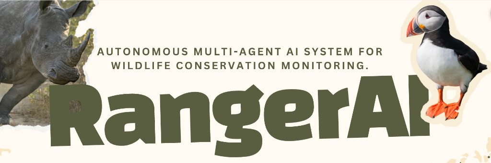

<p align="center">
  
</p>

<h3 align="center">Autonomous multi-agent AI system for wildlife conservation monitoring.</h3>

<p align="center">
  Ingests camera trap imagery and citizen science data, classifies species with GPT-4o,<br>
  scores threats against IUCN Red List data, and delivers real-time alerts to rangers.<br>
  All agent outputs pass through <a href="https://www.civic.com">Civic</a> guardrails via MCP.
</p>

<p align="center">
  <a href="#quickstart">Quickstart</a> · <a href="#architecture">Architecture</a> · <a href="#environment-variables">Env Vars</a> · <a href="https://www.canva.com/design/DAHEgfi8mJI/esZfDGySE5J-ViyFpqayCQ/edit?utm_content=DAHEgfi8mJI&utm_campaign=designshare&utm_medium=link2&utm_source=sharebutton">Pitch Deck</a>
</p>

---

## Quickstart

> Judges: zero to running in under 5 minutes.

### Prerequisites

- [Bun](https://bun.sh) v1.3+ (`curl -fsSL https://bun.sh/install | bash`)
- [MongoDB](https://www.mongodb.com/docs/manual/installation/) running locally on default port, or a connection string in `.env`
- API keys (see [Environment Variables](#environment-variables))

### 1. Clone and install

```bash
git clone https://github.com/EggsLeggs/RangerAI.git
cd RangerAI
bun install
```

### 2. Configure environment

```bash
cp .env.example .env
# fill in your API keys (at minimum: OPENAI_API_KEY, IUCN_TOKEN, CIVIC_API_KEY)
```

### 3. Start everything

```bash
bun run dev
```

This single command starts:

| Service | URL | What it does |
|---|---|---|
| Agent pipeline | `http://localhost:4000` | Ingest, vision, threat, and alert agents + dev monitor |
| Dashboard | `http://localhost:3000` | Next.js UI with live map, alert feed, and guardrail strip |

The ingest agent begins polling iNaturalist and GBIF automatically. Sightings flow through classification, threat scoring, and alert dispatch without intervention.

---

## Architecture

Four agents run in sequence, connected by an event bus. All guardrail calls go through the Civic MCP server.

```text
iNaturalist API ──┐
                  ├── ingest agent ──► vision agent ──► threat agent ──► alert agent
GBIF API ─────────┘                        │                  │               │
                                           └──────────────────┴───────────────┘
                                                              │
                                                      civic-mcp server
                                              (inspect_input / inspect_output
                                                / audit_log via MCP protocol)
```

| Agent | Responsibility |
|---|---|
| **Ingest** | Polls iNaturalist and GBIF on a cron, deduplicates observations, maintains a FIFO queue |
| **Vision** | Sends images to GPT-4o for structured species classification, validates against iNaturalist taxa |
| **Threat** | Looks up IUCN conservation status and range data, scores anomalies 0-100, assigns severity |
| **Alert** | Formats alerts, dispatches via webhook and email, generates illustrated conservation field reports |
| **Civic MCP** | Local MCP server exposing `inspect_input`, `inspect_output`, `audit_log` - guardrails as a first-class service |

For the full architecture specification, see [`CLAUDE.md`](CLAUDE.md).

---

## Repo Structure

```text
RangerAI/
├── packages/
│   ├── shared/           # types, constants, event bus, db
│   ├── ingest-agent/     # iNaturalist + GBIF polling
│   ├── vision-agent/     # GPT-4o classification via Vercel AI SDK
│   ├── threat-agent/     # IUCN scoring + severity
│   ├── alert-agent/      # formatting, dispatch, illustrated reports
│   ├── civic-mcp/        # MCP server exposing Civic guardrail tools
│   └── dashboard/        # Next.js App Router UI
├── scripts/
│   └── run.ts            # agent pipeline entrypoint
├── reports/              # generated field reports (gitignored)
├── assets/               # static assets (banner, etc.)
├── .env.example          # env var template
├── package.json          # bun workspace root
└── CLAUDE.md             # full project context
```

---

## Environment Variables

Copy `.env.example` to `.env` and fill in the values. Required keys are marked.

| Variable | Required | Description |
|---|---|---|
| `MONGODB_URI` | **yes** | MongoDB connection string (default: `mongodb://localhost:27017/rangerai`) |
| `OPENAI_API_KEY` | **yes** | GPT-4o classification + DALL-E 3 report illustrations |
| `IUCN_TOKEN` | **yes** | IUCN Red List API v4 for conservation status and range data |
| `CIVIC_API_KEY` | **yes** | Civic guardrail SDK for input/output inspection |
| `GBIF_TOKEN` | no | GBIF occurrence search (works without, but rate-limited) |
| `INATURALIST_API_KEY` | no | iNaturalist observations (works without token) |
| `INATURALIST_MAX_RESULTS` | no | Max observations per poll (default: 200) |
| `MCP_PORT` | no | Civic MCP server port (default: 3001) |
| `RESEND_ENABLED` | no | Set `true` to enable email alerts via Resend |
| `RESEND_API_KEY` | no | Resend API key for email dispatch |
| `ALERT_FROM_EMAIL` | no | Sender address for email alerts |
| `ALERT_TO_EMAIL` | no | Recipient address for email alerts |
| `DASHBOARD_ALERT_API_KEY` | no | Bearer token for the dashboard webhook endpoint |
| `WEBHOOK_URL` | no | Alert webhook URL (default: `http://localhost:3000/api/alerts`) |
| `S3_ENDPOINT` | no | S3-compatible endpoint for hosted report storage |
| `S3_REGION` | no | S3 region (default: `auto`) |
| `S3_BUCKET` | no | S3 bucket name |
| `S3_ACCESS_KEY_ID` | no | S3 access key |
| `S3_SECRET_ACCESS_KEY` | no | S3 secret key |

---

## Scripts

| Command | What it does |
|---|---|
| `bun install` | Install all workspace dependencies |
| `bun run dev` | Start agent pipeline + dashboard concurrently |
| `bun run build` | Build all packages |
| `bun run test` | Run tests across all packages |
| `bun run lint` | Lint all packages |
| `bun run typecheck` | Type-check all packages |

---

## Hackathon Tracks

Built for the **AI London Hackathon**, entering four tracks:

- **AI Agents** - autonomous end-to-end pipeline, multi-step reasoning across four agents
- **Vibe Coding** - entire project built with AI-assisted development (Claude Code + Cursor)
- **Civic Guardrails** - Civic as a first-class MCP service, not bolted on
- **Creative AI** - AI-generated illustrated conservation field reports

---

## Tech Stack

TypeScript · Bun · Vercel AI SDK · GPT-4o · Next.js · Leaflet · Tailwind · Civic SDK via MCP · DALL-E 3 · Resend · MongoDB

---

## License

MIT
